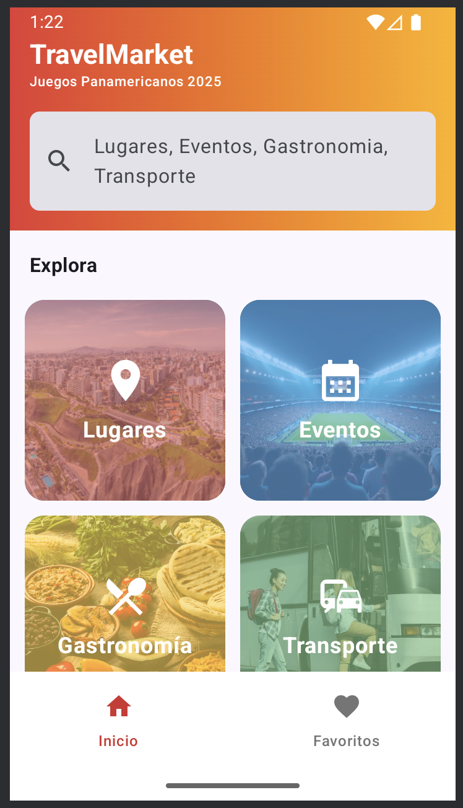
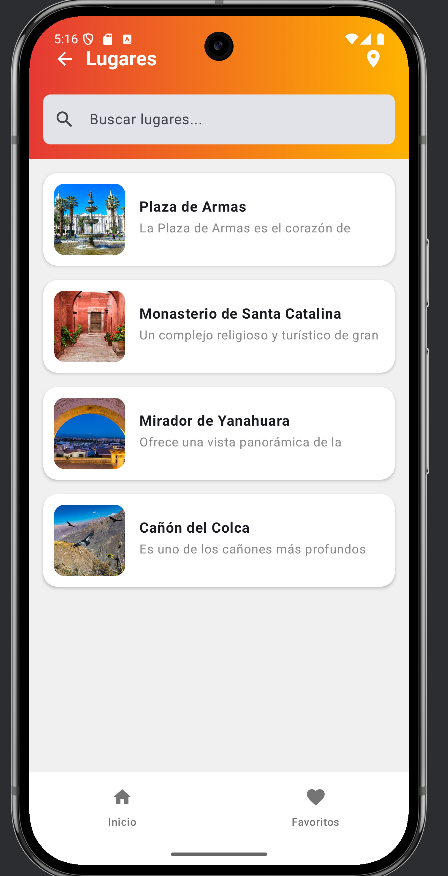
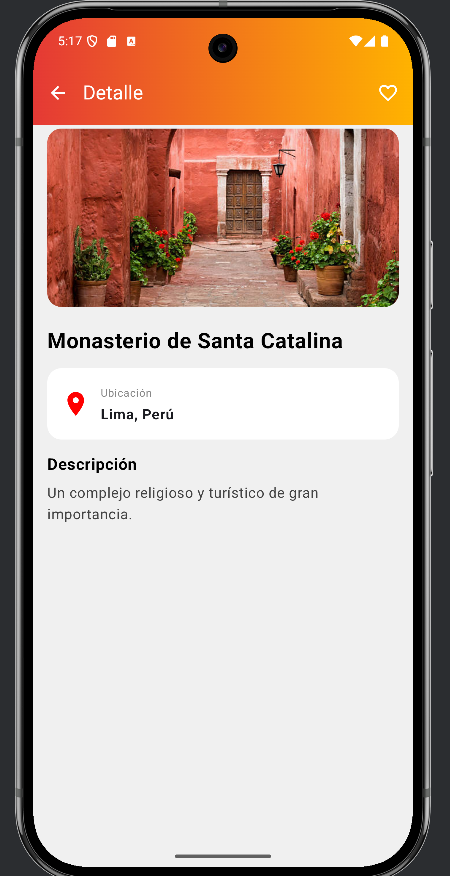
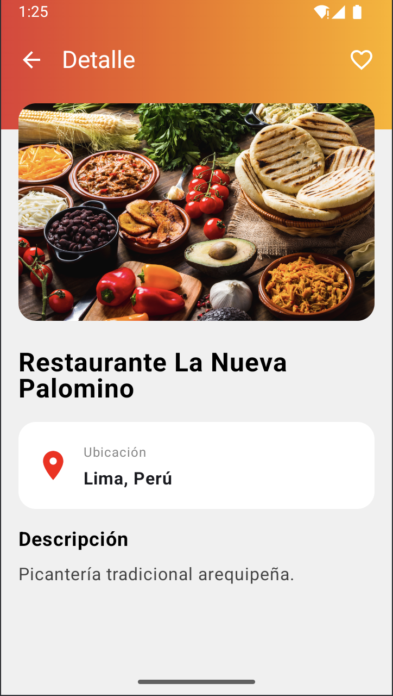
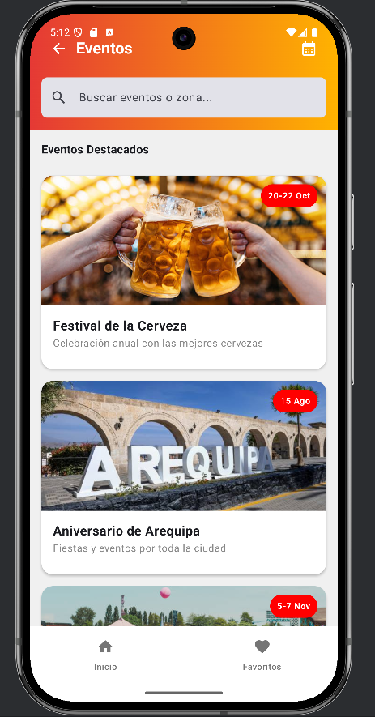
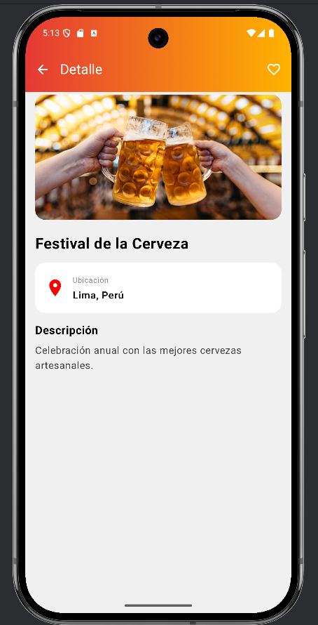
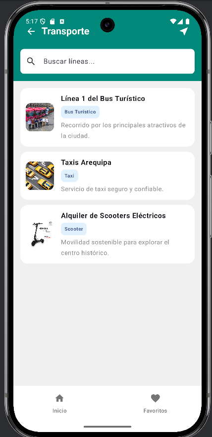
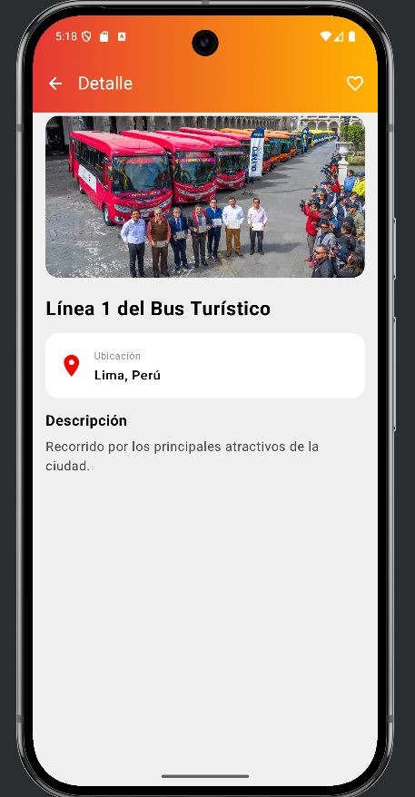
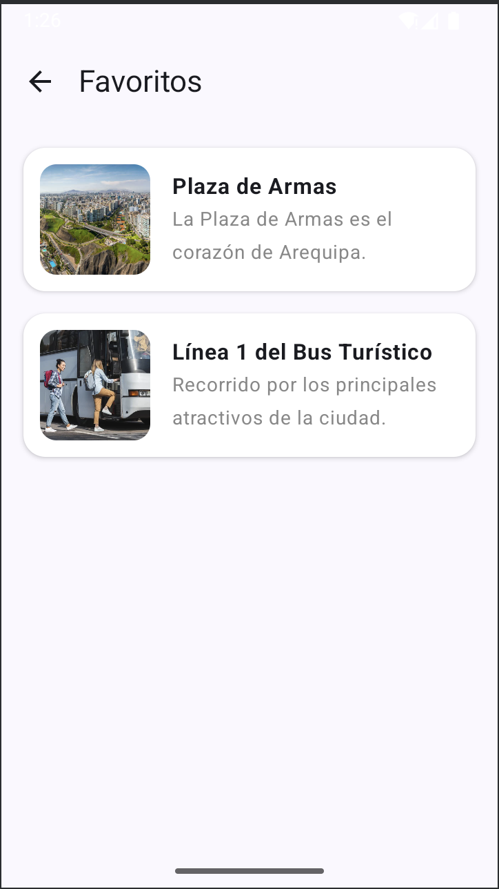

# 🧳 TravelMarket

Aplicación móvil para turistas que asisten a los **Juegos Panamericanos**.  
Permite explorar **lugares, eventos, gastronomía y transporte** locales, brindando una experiencia útil e intuitiva para los visitantes.

---

## 🎯 Objetivo general
Desarrollar una aplicación móvil Android donde los turistas puedan descubrir lugares, eventos, servicios y experiencias durante los Juegos Panamericanos, visualizando información útil desde un único lugar.

---

## 👨‍🏫 Docente
**JUAN LEON S.**

---

## 🧩 Equipo de desarrollo

| Rol | Integrante | Función |
|------|-------------|----------|
| 🧠 Líder técnico | **Jheremy Strong** | Coordinación general, desarrollo Android y control de versiones. |
| 🎨 Diseñador UI | **Jamir Venturo** | Diseño de prototipo en Figma y coherencia visual. |
| 🧪 Tester / Documentador | **Enrique Oporto** | Pruebas, validación y documentación. |

---

## 🛠️ Tecnologías utilizadas
- **Android Studio** (Kotlin + Jetpack Compose)
- **Navigation Compose** (navegación entre pantallas)
- **Figma** (prototipo y diseño UI/UX)
- **Material Design 3**
- **Git & GitHub** (control de versiones y colaboración)

---

## 📱 Prototipo en Figma
👉 [Prototipo TravelMarket en Figma](https://www.figma.com/make/GUgkBF1eWoCB5p72vsujMU/TravelMarket-Mobile-Prototype?node-id=0-4&t=yYzTUUGkj0A4R2pt-1)

---

## 📅 Requerimientos Funcionales

### 🧭 DÍA 1 – Análisis y prototipo (Figma + planificación)
| Código | Descripción |
|--------|--------------|
| **RF01** | El sistema debe permitir visualizar una pantalla de inicio (Home) con accesos a las principales categorías (lugares, eventos, gastronomía, transporte). |
| **RF02** | El sistema debe contar con una pantalla de detalle para mostrar la información de cada elemento (nombre, descripción, imagen, ubicación). |
| **RF03** | El sistema debe incluir una sección de perfil o 'favoritos' para guardar elementos seleccionados por el usuario. *(Definido solo en el prototipo)* |
| **RF04** | El prototipo debe representar el flujo de navegación entre pantallas principales. |
| **RF05** | El prototipo debe estar diseñado en Figma y documentado en este README. |

---

### 🧱 DÍA 2 – Estructura base del proyecto
| Código | Descripción |
|--------|--------------|
| **RF06** | El sistema debe estar desarrollado en Android Studio usando Kotlin y Jetpack Compose. |
| **RF07** | El proyecto debe implementar una arquitectura organizada (ui, data, model, navigation). |
| **RF08** | El sistema debe contar con un navegador de pantallas basado en Navigation Compose. |
| **RF09** | El repositorio GitHub debe estar correctamente configurado con ramas para cada integrante. |
| **RF10** | El sistema debe ejecutar correctamente la navegación entre pantallas base (Home, Detalle, Perfil). |

---

### 🎨 DÍA 3 – Desarrollo de interfaz de usuario
| Código | Descripción |
|--------|--------------|
| **RF11** | El sistema debe mostrar en la pantalla principal una lista de elementos (LazyColumn o Grid). |
| **RF12** | El sistema debe mostrar imágenes, textos y botones interactivos en la interfaz. |
| **RF13** | El diseño debe respetar la guía de estilo de Material 3. |
| **RF14** | El sistema debe permitir navegar desde un elemento de la lista hacia su detalle. |
| **RF15** | Todas las pantallas deben tener una interfaz visual coherente con el diseño en Figma. |

---

### 🧠 DÍA 4 – Manejo de datos y navegación dinámica
| Código | Descripción |
|--------|--------------|
| **RF16** | El sistema debe contener modelos de datos (ej. Lugar, Evento, Servicio). |
| **RF17** | El sistema debe mostrar información dinámica cargada desde una fuente local (lista o JSON simulado). |
| **RF18** | El sistema debe actualizar el contenido de la pantalla de detalle al seleccionar un elemento. |
| **RF19** | El sistema debe manejar correctamente la navegación de retorno entre pantallas. |
| **RF20** | Los datos deben mantenerse organizados en una capa de datos (repositorio o ViewModel). |

---

### 🔍 DÍA 5 – Funcionalidades complementarias e integración
| Código | Descripción |
|--------|--------------|
| **RF21** | El sistema debe permitir filtrar o buscar elementos por nombre o categoría. |
| **RF22** | El sistema debe incluir imágenes remotas o locales para enriquecer la presentación. |
| **RF23** | El sistema debe manejar correctamente errores de carga o datos vacíos. |
| **RF24** | El repositorio GitHub debe registrar todos los commits con mensajes descriptivos. |
| **RF25** | El sistema debe integrarse sin errores tras la fusión de ramas (merge final). |

---

### 🎤 DÍA 6 – Presentación, documentación y cierre
| Código | Descripción |
|--------|--------------|
| **RF26** | El sistema debe contar con un README.md completo con descripción, capturas y enlaces. |
| **RF27** | El sistema debe ejecutarse correctamente en un emulador o dispositivo Android. |
| **RF28** | El equipo debe etiquetar una versión final (release v1.0) en GitHub. |
| **RF29** | El equipo debe presentar la aplicación mostrando la navegación y funcionalidad implementada. |
| **RF30** | La aplicación debe representar correctamente la propuesta del prototipo inicial. |

---
[🎥 Ver demo del proyecto](https://drive.google.com/file/d/1RoRH6Mboyn79nNj7Go40HQtZuKW4n-zY/view?usp=sharing)

## 📸 Capturas de pantalla

### Pantalla de Inicio

### Pantalla de Lugares

### Detalle de un Lugar

### Pantalla de Gastronomía

### Detalle de Gastronomía

### Pantalla de Eventos

### Detalle de un Evento

### Pantalla de Transporte

### Detalle de Transporte

### Pantalla de Favoritos

